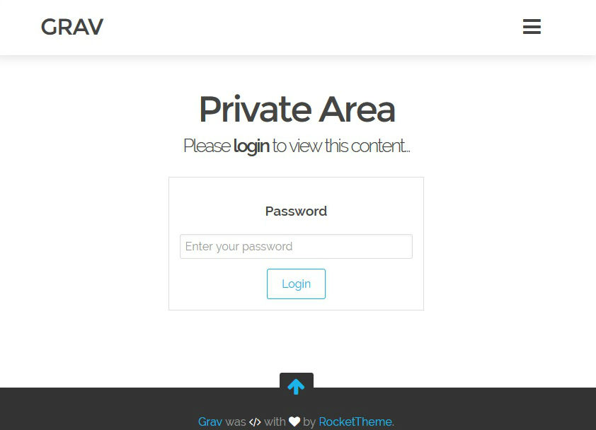

# Private Grav Plugin

`Private` is a [Grav](http://github.com/getgrav/grav) Plugin. (Need help for a best english documentation. )

It provide an authentication form to keep your Grav site or part of it private.

# Installation

Installing the Private plugin can be done in one of two ways. Our GPM (Grav Package Manager) installation method enables you to quickly and easily install the plugin with a simple terminal command, while the manual method enables you to do so via a zip file. 

## GPM Installation (Preferred)

The simplest way to install this plugin is via the [Grav Package Manager (GPM)](http://learn.getgrav.org/advanced/grav-gpm) through your system's Terminal (also called the command line).  From the root of your Grav install type:

    bin/gpm install private

This will install the Private plugin into your `/user/plugins` directory within Grav. Its files can be found under `/your/site/grav/user/plugins/private`.

## Manual Installation

To install this plugin, just download the zip version of this repository and unzip it under `/your/site/grav/user/plugins`. Then, rename the folder to `private`. You can find these files either on [GitHub](https://github.com/diyzzuf/grav-plugin-private) or via [GetGrav.org](http://getgrav.org/downloads/plugins#extras).

You should now have all the plugin files under

    /your/site/grav/user/plugins/private

# Usage

By default, the password is `password`, username is **not** nedded and Grav is **fully private**.

To customize this parameters (and more), you first need to create an override config. To do so, create the folder `user/config/plugins` (if it doesn't exist already) and copy the [private.yaml](private.yaml) config file in there and then make your edits.

## Recommended Todo (See Options Section)
1. **Change** the default password in your `user/config/plugins/private.yaml`
2. **Change** the default security salt in your `user/config/plugins/private.yaml`
3. **Customize** your privacy rules

# Options

###### Plugin
Enable or Disable the entire plugin (default: `true`).

    enabled: (true|false)

###### Routing
Routes of login and logout. You can customize it by simple replacement of the value (e.g: login: "/admin" for "mywebsite.com/admin" )

    routes:
        login: "/login"
        logout: "/logout"

###### Security Salt
Security Salt for session. You can go to this [generator](http://www.sethcardoza.com/tools/random-password-generator/) for your own.

    session_ss: random_value

###### Private Site
If `true`, the entire site is private. If false, privacy are enable on your page tagges by the `private_tag` ( See after ) (default: `true`)

    private_site: (true|false)
    
###### Private Tag
Identification for privates pages if `private_site` is `false`. You **should** add the private_tag on your private page. ( default: `hidden`)
See [Grav Taxonomy](http://learn.getgrav.org/content/taxonomy) for more information.

    private_tag: hidden

###### Username on login page
Enable (`true`) or Disable (`false`) username on the login page. (default: `false`)
> Note : If you disable the username, you need to **keep** `no_user` username on users parameters
    enable_username: (true|false)

###### Users list
List of users. For adding user, just create a new line with **keeping the identation**. (default password: `password`)
> Note : If enable_username is `false`, the user **MUST BE KEEPING** on `no_user`

>> Note : The password **MUST BE** on SHA1. See [SHA1 Online](http://www.sha1-online.com) to generate your sha1 password.

    users:
        no_user : sha1_password

###### Text
Some text for this plugin that you can translate on your language

    fields:
        username:
            label: "Username"
            placeholder: "Enter your username"

# Updating

As development for the Private plugin continues, new versions may become available that add additional features and functionality, improve compatibility with newer Grav releases, and generally provide a better user experience. Updating Private is easy, and can be done through Grav's GPM system, as well as manually.

## GPM Update (Preferred)

The simplest way to update this plugin is via the [Grav Package Manager (GPM)](http://learn.getgrav.org/advanced/grav-gpm). You can do this with this by navigating to the root directory of your Grav install using your system's Terminal (also called command line) and typing the following:

bin/gpm update private

This command will check your Grav install to see if your Private plugin is due for an update. If a newer release is found, you will be asked whether or not you wish to update. To continue, type `y` and hit enter. The plugin will automatically update and clear Grav's cache.

## Manual Update

Manually updating Private is pretty simple. Here is what you will need to do to get this done:

* Delete the `your/site/user/plugins/private` directory.
* Downalod the new version of the Private plugin from either [GitHub](https://github.com/diyzzuf/grav-plugin-private) or [GetGrav.org](http://getgrav.org/downloads/plugins#extras).
* Unzip the zip file in `your/site/user/plugins` and rename the resulting folder to `private`.
* Clear the Grav cache. The simplest way to do this is by going to the root Grav directory in terminal and typing `bin/grav clear-cache`.

> Note: Any changes you have made to any of the files listed under this directory will also be removed and replaced by the new set. Any files located elsewhere (for example a YAML settings file placed in `user/config/plugins`) will remain intact.
